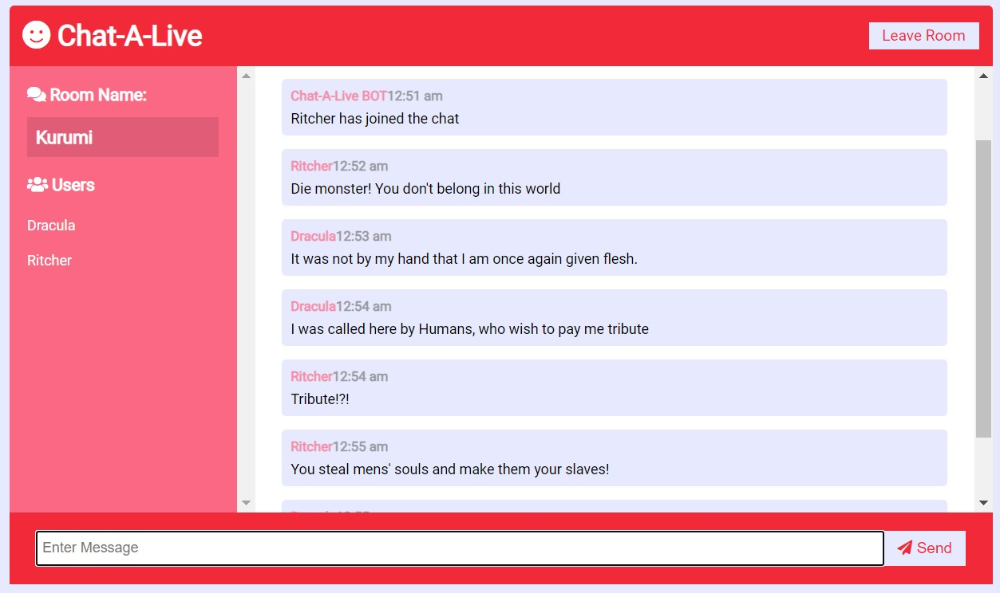

# Chat-A-Live

## Description
It is a chat application which uses node.js, socket.io and express. This is just a prototype of a discussion/group chats which uses the concept of chat rooms.
> Tutorial can be found [here](https://www.youtube.com/watch?v=jD7FnbI76Hg)

## How To Setup
Since it uses `Node.js` therefore you will need to install that onto your machine. 
> You can get Node.js from [here](https://nodejs.org/en/)

when that is done, download and extract this repo in any directory, open the terminal and run the following:
```
npm install
```
this will install all the dependencies for this app

> **NOTE:** make sure you have the `package.json` file in that directory as well. 

Once the installation of dependencies are finished, you can run the following to start this app on `port 3000`:
```
npm run start
```
This will start the app using simple `node`
or alternatively you can do this:
```
npm run dev
```
which will start the app using `nodemon`.

Your app will be present on the following url:
```
http://localhost:3000/
```

This is all for the setup. But there is also a settings.json file included in this package which you can tamper with and reflect changes on the app.

## Deployed Sample
I deployed this app on heroku therefore you can test or play with the app on the URL below:

> [https://chat-a-live.herokuapp.com/](https://chat-a-live.herokuapp.com/)

> **NOTE:** since I haven't yet integrated a database in it, so no messages will be stored anywhere and all the chat history will be oblierated from existence once you close the tab or refreash the page.

## Next Steps
- I'm going to implement a `mongoDB` Database in it for storage of messages.
- Then I'll try to use `Apache Kafka` for scalability of the application.
- And of course there are alot of things which can be improved. so I will be working on that as well.

## Preview
